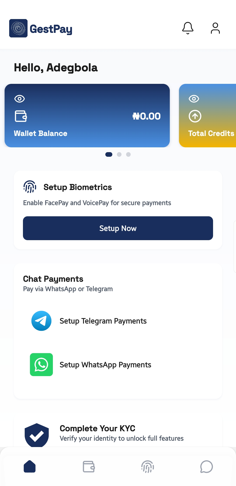
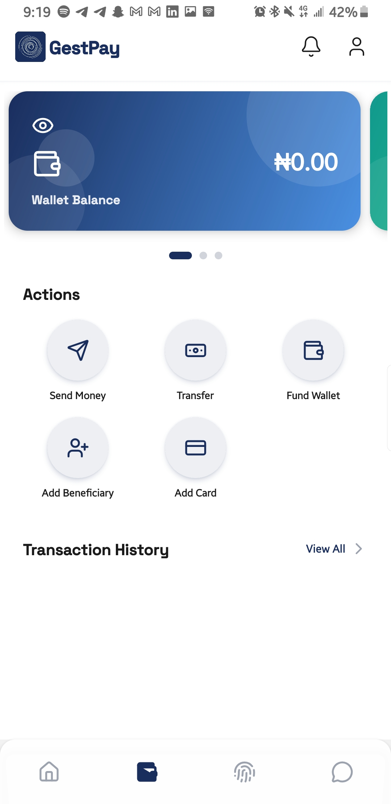
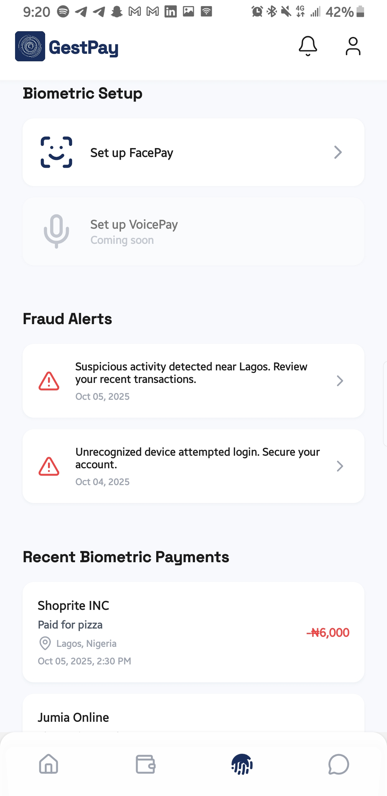
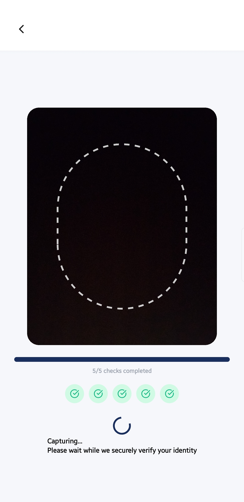
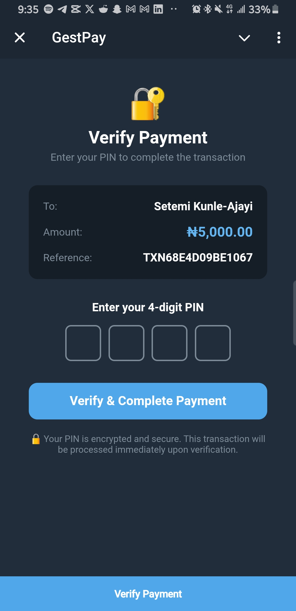
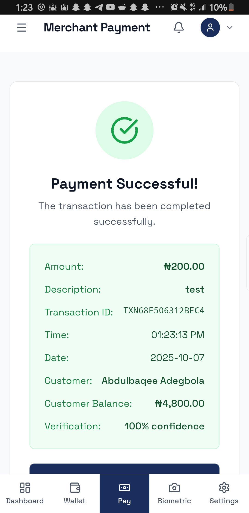

# GestPay Mobile Application

A modern React Native mobile application built with Expo for the GestPay payment platform, featuring face recognition authentication, secure payments, and comprehensive financial management.



## 🚀 Features

- **Face Recognition Authentication** - Secure biometric login and payment authorization
- **Cross-Platform Compatibility** - iOS, Android, and Web support
- **Secure Payment Processing** - End-to-end encrypted transactions
- **Real-time Notifications** - Instant payment alerts and updates
- **Offline Capability** - Core features work without internet connection
- **Modern UI/UX** - Clean, intuitive interface with custom animations
- **Multi-language Support** - Localization ready
- **Dark/Light Theme** - Adaptive UI themes

## 📋 Prerequisites

- **Node.js** 18.0 or higher
- **npm** or **yarn** package manager
- **Expo CLI** (`npm install -g @expo/cli`)
- **iOS Simulator** (macOS) or **Android Studio** (for Android development)
- **Expo Go** app (for testing on physical devices)

## 🛠️ Installation & Setup

### 1. Install Expo CLI

```bash
# Install Expo CLI globally
npm install -g @expo/cli

# Verify installation
expo --version
```

### 2. Clone and Install Dependencies

```bash
# Navigate to mobile-app directory
cd mobile-app

# Install dependencies
npm install
# or
yarn install
```

### 3. Environment Configuration

Create a `.env` file in the root directory:

```env
# API Configuration
EXPO_PUBLIC_API_BASE_URL=https://gestpay.souktrainproperties.com/api/v1
EXPO_PUBLIC_FACE_API_URL=http://localhost:8000

# App Configuration
EXPO_PUBLIC_APP_NAME=GestPay
EXPO_PUBLIC_APP_VERSION=1.0.0
EXPO_PUBLIC_BUNDLE_ID=

# Development
EXPO_PUBLIC_DEV_MODE=true
EXPO_PUBLIC_DEBUG_MODE=false

# Analytics (Optional)
EXPO_PUBLIC_ANALYTICS_ID=your_analytics_id
```

### 4. Development Server

```bash
# Start Expo development server
expo start

# Start with specific platform
expo start --android    # Android
expo start --ios        # iOS
expo start --web        # Web browser

# Start with tunnel (for testing on external devices)
expo start --tunnel
```

### 5. Testing on Devices

#### Physical Device Testing
1. Install **Expo Go** from App Store (iOS) or Google Play (Android)
2. Scan the QR code from the terminal
3. App will load on your device

#### Simulator Testing
```bash
# iOS Simulator (macOS only)
expo start --ios

# Android Emulator
expo start --android
```

## ⚙️ Configuration Files


### Package Configuration (`package.json`)

Key dependencies and scripts:
```json
{
  "scripts": {
    "start": "expo start",
    "android": "expo start --android",
    "ios": "expo start --ios",
    "web": "expo start --web"
  },
  "dependencies": {
    "expo": "~54.0.12",
    "react": "19.1.0",
    "react-native": "0.81.4",
    "@react-navigation/native": "^7.1.18",
    "@reduxjs/toolkit": "^2.9.0",
    "expo-camera": "^17.0.8",
    "expo-secure-store": "^15.0.7"
  }
}
```

## 📱 Application Screenshots

<div style="display: flex; gap: 10px;">
  
  
  
</div>


<div style="display: flex; gap: 10px;">
  
  
</div>


<div style="display: flex; gap: 10px;">
  
  
</div>

<div style="display: flex; gap: 10px;">
  
  
  
</div>

*Payment processing, transaction history, and success confirmation*


## 📦 Key Dependencies

### Core Framework
- **Expo SDK 54.0.12** - React Native development platform
- **React 19.1.0** - UI library
- **React Native 0.81.4** - Mobile framework

### Navigation
- **@react-navigation/native 7.1.18** - Navigation library
- **@react-navigation/native-stack 7.3.27** - Stack navigation
- **@react-navigation/bottom-tabs 7.4.8** - Tab navigation

### State Management
- **@reduxjs/toolkit 2.9.0** - State management
- **react-redux 9.2.0** - React Redux bindings

### UI & Styling
- **expo-linear-gradient 15.0.7** - Gradient backgrounds
- **expo-blur 15.0.7** - Blur effects
- **lucide-react-native 0.544.0** - Icon library
- **react-native-modal 14.0.0-rc.1** - Modal components

### Device Features
- **expo-camera 17.0.8** - Camera access for face recognition
- **expo-secure-store 15.0.7** - Secure storage
- **@react-native-async-storage/async-storage 2.2.0** - Local storage

### Fonts & Assets
- **expo-font 14.0.8** - Custom font loading
- **Space Grotesk** - Primary font family

## 🚀 Build & Deployment

### Development Build

```bash
# Create development build
eas build --profile development --platform all

# Install on device
eas build --profile development --platform android --local
```

### Production Build

```bash
# Build for app stores
eas build --profile production --platform all

# Build specific platform
eas build --profile production --platform ios
eas build --profile production --platform android
```

### App Store Submission

```bash
# Submit to App Store (iOS)
eas submit --platform ios

# Submit to Google Play (Android)
eas submit --platform android
```

## 🔧 Development Scripts

```bash
# Start development server
npm start
# or
expo start

# Platform-specific development
npm run android      # Android development
npm run ios          # iOS development  
npm run web          # Web development

# Clear cache
expo start -c

# Reset project
expo install --fix
```


## 🔒 Security Features

- **Biometric Authentication** - Face recognition and fingerprint
- **Secure Storage** - Encrypted local data storage
- **JWT Token Management** - Secure authentication tokens
- **API Encryption** - End-to-end encrypted communications
- **Certificate Pinning** - Protection against man-in-the-middle attacks
- **Root Detection** - Security checks for compromised devices

## 📱 Platform-Specific Features

### iOS Features
- **Face ID Integration** - Native biometric authentication
- **Apple Pay Support** - Native payment integration
- **Push Notifications** - APNs integration
- **Keychain Storage** - Secure credential storage

### Android Features
- **Fingerprint Authentication** - Native biometric support
- **Google Pay Integration** - Native payment support
- **Firebase Notifications** - FCM integration
- **Android Keystore** - Secure storage

## 🐛 Troubleshooting

### Common Issues

1. **Expo CLI Not Found:**
   ```bash
   npm install -g @expo/cli
   # or
   yarn global add @expo/cli
   ```

2. **Metro Bundler Issues:**
   ```bash
   # Clear cache
   expo start -c
   
   # Reset Metro cache
   npx react-native start --reset-cache
   ```

3. **Camera Permissions:**
   - Ensure camera permissions are granted in device settings
   - Check `app.json` permissions configuration
   - Restart the app after granting permissions

4. **Face Recognition Not Working:**
   - Verify backend face recognition service is running
   - Check camera permissions
   - Ensure proper lighting conditions

5. **Build Errors:**
   ```bash
   # Clean and reinstall
   rm -rf node_modules package-lock.json
   npm install
   
   # Clear Expo cache
   expo install --fix
   ```

6. **Android Emulator Issues:**
   - Ensure Android Studio is properly installed
   - Check AVD configuration
   - Enable hardware acceleration

## 📊 Performance Optimization

- **Image Optimization** - Compressed assets and lazy loading
- **Bundle Splitting** - Code splitting for faster startup
- **Memory Management** - Efficient state management
- **Network Optimization** - Request caching and batching
- **Animation Performance** - Native driver usage
- **Startup Time** - Optimized splash screen and font loading

## 🔄 State Management

Redux Toolkit manages global application state:

- **Authentication State** - User login status and profile
- **Payment State** - Transaction data and history
- **UI State** - Loading states, modals, and notifications
- **Settings State** - App preferences and configuration
- **Biometric State** - Face recognition setup status
