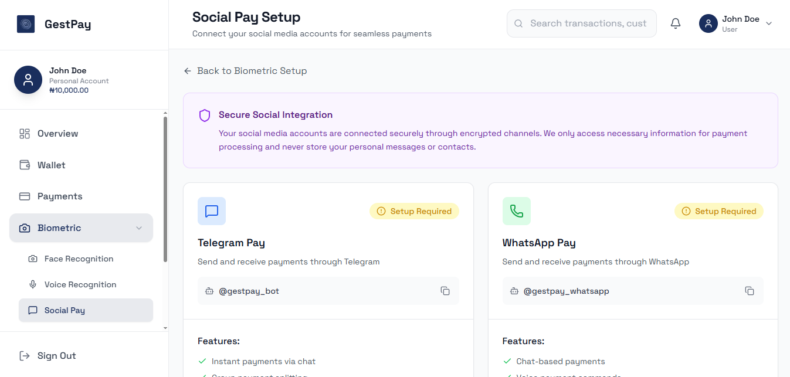

# GestPay Web Application

A modern Next.js web application for GestPay payment platform featuring face recognition, analytics dashboard, and comprehensive payment management.


## 🚀 Features

- **Face Recognition Payment** - Secure biometric authentication
- **Real-time Analytics** - Comprehensive payment insights
- **Merchant Dashboard** - Complete payment management
- **Social Pay Integration** - WhatsApp and social payment features
- **Fraud Detection** - Advanced security monitoring
- **Responsive Design** - Mobile-first approach with Tailwind CSS

## 📋 Prerequisites

- **Node.js** 18.0 or higher
- **npm** or **yarn** package manager
- **Backend API** running (GestPay PHP backend)

## 🛠️ Installation & Setup

### 1. Clone and Install Dependencies

```bash
# Navigate to web-app directory
cd web-app

# Install dependencies
npm install
# or
yarn install
```

### 2. Environment Configuration

Create a `.env.local` file in the root directory:

```env
# API Configuration
NEXT_PUBLIC_API_BASE_URL=http://localhost/api/v1
NEXT_PUBLIC_APP_URL=http://localhost:3000

# Face Recognition API
NEXT_PUBLIC_FACE_API_URL=http://localhost:8000

# App Configuration
NEXT_PUBLIC_APP_NAME=GestPay
NEXT_PUBLIC_APP_VERSION=1.0.0

```

### 3. Development Server

```bash
# Start development server with Turbopack
npm run dev

# Alternative package managers
yarn dev
pnpm dev
bun dev
```

Open [http://localhost:3000](http://localhost:3000) to view the application.

### 4. Production Build

```bash
# Build for production
npm run build

# Start production server
npm start
```

## ⚙️ Configuration Files

### Next.js Configuration (`next.config.js`)

```javascript
/** @type {import('next').NextConfig} */
const nextConfig = {
  // API Proxy Configuration
  async rewrites() {
    return [
      {
        source: '/api/v1/:path*',
        destination: 'http://localhost/api/v1/:path*',
      },
    ];
  },
  
  // CORS Headers
  async headers() {
    return [
      {
        source: '/api/v1/:path*',
        headers: [
          { key: 'Access-Control-Allow-Credentials', value: 'true' },
          { key: 'Access-Control-Allow-Origin', value: '*' },
          { key: 'Access-Control-Allow-Methods', value: 'GET,OPTIONS,PATCH,DELETE,POST,PUT' },
          { key: 'Access-Control-Allow-Headers', value: 'X-CSRF-Token, X-Requested-With, Accept, Accept-Version, Content-Length, Content-MD5, Content-Type, Date, X-Api-Version, Authorization, authorization' },
        ],
      },
    ];
  },
  
  experimental: {
    serverActions: true,
  },
};
```

### Tailwind CSS Configuration (`tailwind.config.js`)

```javascript
module.exports = {
  content: [
    "./src/pages/**/*.{js,ts,jsx,tsx,mdx}",
    "./src/components/**/*.{js,ts,jsx,tsx,mdx}",
    "./src/app/**/*.{js,ts,jsx,tsx,mdx}",
  ],
  theme: {
    extend: {
      colors: {
        primary: '#1a2e5d',  // GestPay brand color
      },
      fontFamily: {
        'space': ['Space Grotesk', 'system-ui', 'sans-serif'],
      },
    },
  },
  plugins: [],
};
```

### Path Aliases (`jsconfig.json`)

```json
{
  "compilerOptions": {
    "paths": {
      "@/*": ["./src/*"]
    }
  }
}
```

## 🎨 Application Screenshots

### Home Dashboard

*Main dashboard with payment overview and quick actions*

### Face Recognition Setup

*Biometric authentication setup interface*

### Analytics Dashboard

*Comprehensive payment analytics and insights*

### Merchant Payment Interface

*Streamlined merchant payment processing*

### Social Pay Configuration

*WhatsApp and social media payment integration*

### Fraud Detection Alert

*Real-time fraud detection and security alerts*

### Support Center

*Integrated customer support and help center*

## 🏗️ Project Structure

```
web-app/
├── src/
│   ├── app/                 # Next.js App Router
│   │   ├── globals.css     # Global styles
│   │   ├── layout.js       # Root layout
│   │   └── page.js         # Home page
│   ├── components/         # Reusable UI components
│   │   ├── ui/            # Base UI components
│   │   ├── forms/         # Form components
│   │   └── layout/        # Layout components
│   ├── lib/               # Utility functions
│   ├── hooks/             # Custom React hooks
│   └── store/             # Redux store configuration
├── public/                # Static assets
├── screenshots/           # Application screenshots
├── next.config.js        # Next.js configuration
├── tailwind.config.js    # Tailwind CSS configuration
├── package.json          # Dependencies and scripts
└── vercel.json          # Vercel deployment configuration
```

## 📦 Key Dependencies

### Core Framework
- **Next.js 15.5.4** - React framework with App Router
- **React 19.1.0** - UI library
- **React DOM 19.1.0** - DOM rendering

### State Management
- **@reduxjs/toolkit 2.9.0** - State management
- **react-redux 9.2.0** - React Redux bindings

### Styling & UI
- **Tailwind CSS 3.4.0** - Utility-first CSS framework
- **lucide-react 0.544.0** - Icon library
- **nprogress 0.2.0** - Loading progress bar

### Utilities
- **js-cookie 3.0.5** - Cookie management
- **react-intersection-observer 9.16.0** - Scroll animations

## 🚀 Deployment

### Vercel Deployment (Recommended)

1. **Connect Repository:**
   ```bash
   # Install Vercel CLI
   npm i -g vercel
   
   # Deploy
   vercel
   ```

2. **Environment Variables:**
   Set the following in Vercel dashboard:
   - `NEXT_PUBLIC_API_BASE_URL`
   - `NEXT_PUBLIC_FACE_API_URL`
   - `NEXT_PUBLIC_APP_NAME`

3. **Custom Domain:**
   Configure custom domain in Vercel dashboard

### Manual Deployment

```bash
# Build the application
npm run build

# Export static files (if needed)
npm run export

# Deploy build folder to your hosting provider
```

## 🔧 Development Scripts

```bash
# Development with Turbopack (faster)
npm run dev

# Production build with Turbopack
npm run build

# Start production server
npm start

# Lint code
npm run lint

# Type checking (if using TypeScript)
npm run type-check
```

## 🌐 API Integration

The web app integrates with the GestPay PHP backend through:

- **Base URL:** `http://localhost/gestpay/api`
- **Authentication:** JWT tokens stored in cookies
- **Face Recognition:** Python FastAPI service integration
- **Real-time Updates:** WebSocket connections for live data

### API Endpoints Used
- `/auth/login` - User authentication
- `/payments/` - Payment operations
- `/analytics/` - Dashboard analytics
- `/face-recognition/` - Biometric authentication
- `/merchants/` - Merchant management

## 🔒 Security Features

- **CORS Configuration** - Proper cross-origin resource sharing
- **JWT Authentication** - Secure token-based auth
- **Input Validation** - Client-side and server-side validation
- **XSS Protection** - Content Security Policy headers
- **HTTPS Enforcement** - Secure data transmission

## 🐛 Troubleshooting

### Common Issues

1. **API Connection Failed:**
   ```bash
   # Check if backend is running
   curl http://localhost/api/v1/health
   
   # Verify environment variables
   echo $NEXT_PUBLIC_API_BASE_URL
   ```

2. **Build Errors:**
   ```bash
   # Clear cache and reinstall
   rm -rf .next node_modules package-lock.json
   npm install
   npm run build
   ```

3. **Styling Issues:**
   ```bash
   # Rebuild Tailwind CSS
   npx tailwindcss -i ./src/app/globals.css -o ./dist/output.css --watch
   ```

4. **Face Recognition Not Working:**
   - Ensure camera permissions are granted
   - Check if Python face recognition service is running
   - Verify HTTPS for camera access in production

## 📱 Responsive Design

The application is fully responsive with breakpoints:
- **Mobile:** 320px - 768px
- **Tablet:** 768px - 1024px
- **Desktop:** 1024px+

## 🔄 State Management

Redux Toolkit is used for global state management:
- **Authentication state** - User login/logout
- **Payment data** - Transaction history and status
- **UI state** - Loading states, modals, notifications
- **Analytics data** - Dashboard metrics and charts

## 📊 Performance Optimization

- **Turbopack** - Fast bundler for development and production
- **Image Optimization** - Next.js automatic image optimization
- **Code Splitting** - Automatic route-based code splitting
- **Lazy Loading** - Components and images loaded on demand
- **Caching** - API responses and static assets cached

